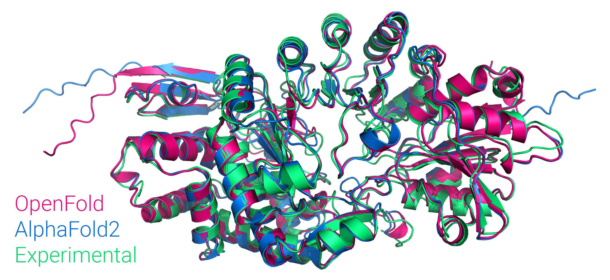

_Figure: Comparison of OpenFold and AlphaFold2 predictions to the experimental structure of PDB 7KDX, chain B._

# FedFold 重写版文档

FedFold 是一个面向蛋白质结构预测的联邦学习 SoloSeq 微调仓库，以 5 个 client
本地微调、FedAvg 全局聚合和独立测试集评测为核心流程，支持从数据准备、pLDDT
难样本筛选、train/test 划分到 TM-score 评测矩阵的完整实验闭环。

本仓库主要参考了 [OpenFold](https://github.com/aqlaboratory/openfold) 和
[AlphaFold 2](https://github.com/deepmind/alphafold)。

# 使用方法：

请参考Sha_log[pipeline](docs/sha_log/fed_finetune_pipeline.md)

# 任务进度：

## 2026.07:

1. 下载了从2025-01-01到2026-07-01的数据(符合结构的总数4334)
2. 修改了一下data下载的文件夹名字，对应需要修改的路径也一起改了(一年的数据在data/all_pdb_1y)
3. data_dir_to_fasta脚本进行了修改，避免一次写入(我的内存不够ORZ)
4. 数据聚类划分已提交，5个client，mmcif文件没有上传，上传了处理好的fasta序列。可以按照姓氏排名分配：

+ He -> client 0
+ HU -> client 1
+ Sha -> client 2
+ Wu -> client 3
+ Wang -> client 4

## 2026.08:

1. 对比之前的全量微调，增加了LoRA微调
2. LoRA微调最佳配置检索， 23 个唯一短训候选组合

+ 4 种 Structure Module target
+ rank 2/4/8，alpha/rank 1/2
+ dropout 0 / 0.05 / 0.1 / 0.2
  最佳（局部最佳）配置：
+ Target：structure_module.ipa, structure_module.transition, structure_module.bb_update（即 core）
+ Rank：4
+ Alpha：8
+ Dropout：0
+ 学习率：1e-4
+ 最佳验证 epoch：5

3. 发现TM score结果非常接近，开始寻找问题
4. 尝试不同学习率发现并没有屌用
5. epoch在client1的64条训练集数据的时候第五轮最佳，往后边开始过拟合
6. 各种尝试最终锁定是模型精度带来的偏差（LoRA微调以及之前的全量微调BF16，原始模型精度FP32）
7. client1 上用最佳 LoRA 配置做 **FP32 训练** 5 epoch（lr=1e-4）后，正式 20 条测试
   mean TM=0.79334，略高于 baseline 0.79305，并明显好于同配置 BF16 训练的 0.787705。
   因此正式流程改为训练/导出/推理全链路 FP32，不再使用 bf16-mixed 训练。
8. 需要注意的是，EMA和raw model的问题，由于训练轮次和数据量都较小，如果是EMA加载的模型其实EMA会严重滞后，比如使用epoch5导出的模型实际上EMA跟epoch1差不多。
9. 对于EMA的问题可以有两种选择，加载EMA，影响也不大；或者直接使用raw model模型不加载EMA权重。
10. 原始的训练文件会保存EMA版本和raw model两种。导出时只取 raw model 的 LoRA A/B，
    base 始终重新取 public EMA 的 FP32 权重。

## FP32 LoRA 五客户端复现

这一节是唯一推荐入口。Git 中只保存各 client 的 FASTA，不保存体积较大的 mmCIF；
脚本会按 FASTA 文件名从 RCSB 自动下载所需 mmCIF，并把所有新文件放进同一个
输出根目录，不会再把中间结果散落到 `fed_split`、`client1_res` 等目录。

### 1.环境准备 直接运行

先进入已经安装好 OpenFold 依赖的任意 Python 环境。Conda 只是可选方案，
virtualenv、venv 或系统 Python 都可以。然后在仓库根目录复制执行：

```bash
# 使用当前环境的 Python；也可以改成 python3 或 Python 的绝对路径
export PYTHON_BIN=python
export GPU_ID=0

# 所有下载、预处理、划分、模型和评测结果统一写到这里
export RUN_ROOT="$PWD/outputs/fed_lora_fp32_v1"

```

脚本会在缺失时自动下载约 605 MB 的 public SoloSeq checkpoint。第一次生成
ESM-1b embedding 时也需要联网。

### 2. 开始训练
```bash
# 准备client数据集 建议跑一下 因为当前的仓库不包含mmcif
# 我把路径改了所以会放在outpus文件夹里面，跟之前文档切割开了
# 所以按照这个直接运行就行
bash scripts/fed_lora_fp32.sh prepare all
# 进行分集 这样每个人电脑上都有全部数据方便使用
bash scripts/fed_lora_fp32.sh split
# 选择自己对应的client进行训练 训练参数是默认调好的
# 如果有问题再说
# 万一结果不好首先考虑：LoRA注入位置？LoRA参数最适化？等等
# 只处理单个 client 时，写成 `0`～`4`，例如：
# 可以写成all 代表一键训练五个client
bash scripts/fed_lora_fp32.sh train 1
bash scripts/fed_lora_fp32.sh evaluate
```

```bash
# （全 5 client一键运行 不推荐）自动执行：下载 mmCIF → 预处理 → 固定划分 → 5 个 client FP32 训练 → 统一评测
bash scripts/fed_lora_fp32.sh all
```

### 统一输出目录

```text
outputs/fed_lora_fp32_v1/
├── run_manifest.json           # Git commit、cluster hash、划分与训练参数
├── clients/client_0..4/        # 下载的 mmCIF、embedding、筛选结果和 cache
├── split/                      # seed=42 的固定 train/test 划分及 native PDB
├── models/client_0..4/         # FP32 训练 checkpoint、日志和合并模型
└── evaluation/
    ├── baseline/
    ├── client_0..4/
    └── summary.csv             # 最终 TM-score / lDDT-Cα / pLDDT 汇总
```

默认实验配置已经固定为：Structure Module core、rank=4、alpha=8、dropout=0、
lr=1e-4、warmup=20、5 epoch、seed=42、FP32 训练与 FP32 推理。train/test 是按
30% sequence cluster 隔离的固定 hold-out，不是交叉验证。

评测会为每个模型生成逐样本的 `tm_score.csv`、`lddt_ca.csv` 和 `plddt.csv`。
其中 lDDT-Cα 和 TM-score 都使用 native 结构；pLDDT 是模型自身的置信度。

需要改路径或运行参数时使用环境变量，不需要修改脚本：

```bash
PYTHON_BIN=/path/to/python \
DATA_ROOT=/path/to/data/all_pdb_1y \
RUN_ROOT=/path/to/output \
GPU_ID=0 \
bash scripts/fed_lora_fp32.sh all
```

# openfold原始文档引导

See our new home for docs at [openfold.readthedocs.io](https://openfold.readthedocs.io/en/latest/), with instructions for installation and model inference/training.

Much of the content from this page may be found [here.](https://github.com/aqlaboratory/openfold/blob/main/docs/source/original_readme.md)

## Copyright Notice

While AlphaFold's and, by extension, OpenFold's source code is licensed under
the permissive Apache Licence, Version 2.0, DeepMind's pretrained parameters
fall under the CC BY 4.0 license, a copy of which is downloaded to
`openfold/resources/params` by the installation script. Note that the latter
replaces the original, more restrictive CC BY-NC 4.0 license as of January 2022.

## Contributing

If you encounter problems using OpenFold, feel free to create an issue! We also
welcome pull requests from the community.

## Citing this Work

Please cite our paper:

```bibtex
@article {Ahdritz2022.11.20.517210,
	author = {Ahdritz, Gustaf and Bouatta, Nazim and Floristean, Christina and Kadyan, Sachin and Xia, Qinghui and Gerecke, William and O{\textquoteright}Donnell, Timothy J and Berenberg, Daniel and Fisk, Ian and Zanichelli, Niccolò and Zhang, Bo and Nowaczynski, Arkadiusz and Wang, Bei and Stepniewska-Dziubinska, Marta M and Zhang, Shang and Ojewole, Adegoke and Guney, Murat Efe and Biderman, Stella and Watkins, Andrew M and Ra, Stephen and Lorenzo, Pablo Ribalta and Nivon, Lucas and Weitzner, Brian and Ban, Yih-En Andrew and Sorger, Peter K and Mostaque, Emad and Zhang, Zhao and Bonneau, Richard and AlQuraishi, Mohammed},
	title = {{O}pen{F}old: {R}etraining {A}lpha{F}old2 yields new insights into its learning mechanisms and capacity for generalization},
	elocation-id = {2022.11.20.517210},
	year = {2022},
	doi = {10.1101/2022.11.20.517210},
	publisher = {Cold Spring Harbor Laboratory},
	URL = {https://www.biorxiv.org/content/10.1101/2022.11.20.517210},
	eprint = {https://www.biorxiv.org/content/early/2022/11/22/2022.11.20.517210.full.pdf},
	journal = {bioRxiv}
}
```

If you use OpenProteinSet, please also cite:

```bibtex
@misc{ahdritz2023openproteinset,
      title={{O}pen{P}rotein{S}et: {T}raining data for structural biology at scale}, 
      author={Gustaf Ahdritz and Nazim Bouatta and Sachin Kadyan and Lukas Jarosch and Daniel Berenberg and Ian Fisk and Andrew M. Watkins and Stephen Ra and Richard Bonneau and Mohammed AlQuraishi},
      year={2023},
      eprint={2308.05326},
      archivePrefix={arXiv},
      primaryClass={q-bio.BM}
}
```

Any work that cites OpenFold should also cite [AlphaFold](https://www.nature.com/articles/s41586-021-03819-2) and [AlphaFold-Multimer](https://www.biorxiv.org/content/10.1101/2021.10.04.463034v1) if applicable.
